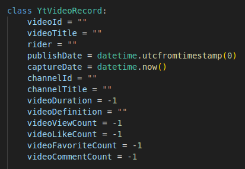
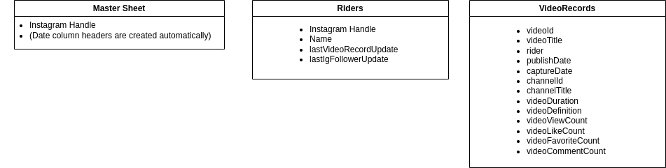

# sm_data_analysis

## Overview
### Google Data Analytics Professional Certificate Capstone Project
Google Data Analytics Professional Certificate Capstone Project
This repo was created during the completion of the final course of the Google Data Analytics Professional certificate. The capstone project for the course has two case study options with existing datasets, or a third option to complete a case study on a new dataset. I selected the third option, and decided to perform a case study for a BMX or BMX adjacent company under a scenario where the company was looking to sponsor a rider for the purpose of promoting their products.

Initially I wanted to track instagram follower counts and post engagement over time to decide who the currently popular riders are. However, instagram API limits greatly slowed the gathering of the data, and it proved near impossible to track a significant number of riders' instagram performance over time. Because of this limitation, I looked for an alternative data source and settled on Youtube. Conveniently, Youtube has a publicly accessible API with generous data limit, and it is a commonly used platform for BMX athletes. 

## Functionalities
### 1. Instagram Follower Data
- Using the instaloader Python module, the follower count for a list of instagram handles is retrieved, and stored in a Google Sheet

### 2. Youtube API Integration
- Using the Youtube Data API, a list of YtVideoRecord is populated and stored in a Google Sheet
  

## Usage
- Instructions on how to use the repository.

### Installation
1. Clone the repository.
2. Install dependencies with `pip install -r requirements.txt`.
3. [Obtain an api key from the Google Cloud Platform](https://support.google.com/googleapi/answer/6158862?hl=en)
4. [Obtain and download OAuth client id JSON](https://support.google.com/googleapi/answer/6158849?hl=en&ref_topic=7013279&sjid=9033449293181056928-AP)
5. Create a Google Sheet that matches the structure of the following tables, making sure to keep the same order of columns
  
6. Change the following fields to match:
    - ytDownloader.py
       - masterSheetId : The id of your selected GoogleSheet
       - keyFileLocation : Make sure that the OAuth client id JSON file from step 4 is in the main folder of the repo
    - igDownloader.py
       - keyFileLocation : Make sure that the OAuth client id JSON file from step 4 is in the main folder of the repo
       - Run 403_error_login_workaround.py, using the instructions in the file, to obtain the necessary cookies.sqlite file and instaloader session
    - googleSheetsHelper.py
       - masterSheetId : The id of your selected GoogleSheet
       - keyFileLocation : Make sure that the OAuth client id JSON file from step 4 is in the main folder of the repo

### Running the Tool
1. Execute `igDownloader.py` to capture Instagram follower data and store it in the MasterSheet sheet 
2. Execute `ytDownloader.py` to gather data from the Youtube API and store it in the VideoRecords sheet

### Additional Configuration
- Both igDownloader and ytDownloader scripts use a column in the Riders sheet to determine which accounts have had the longest time since their last update. If you are wanting to get data for a specific account, you will currently have to manually adjust the date inside this field so that it is the oldest date.
- Instagram has reasonably strict API access limits, and I have found that the instaloader module used by igDownloader.py will struggle to capture follower counts for more than 100 accounts at a time. Running the script regularly can result in a 403 error, and the 403_error_login_workaround.py script will need to be used if this happens.

## License

This project is licensed under the [MIT License](LICENSE).
