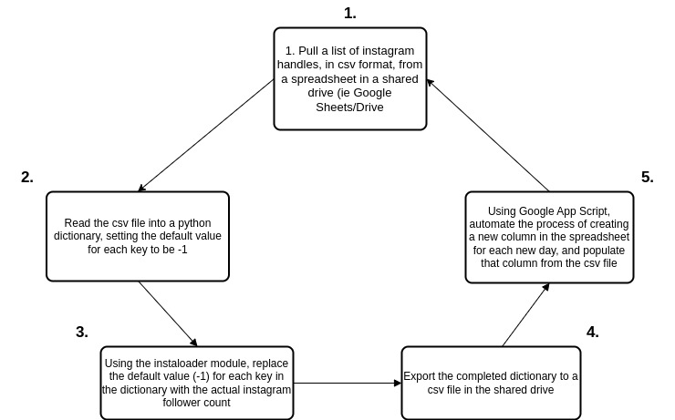

# sm_data_analysis
The aim of this repository is to create a tool to pull follower and engagement data from instagram using python, and save it in a csv format.

A log of progress will be kept here in the README file

The daily lifecyle of data movement in this project is as follows:
1 - Pull a list of instagram handles, in csv format, from a spreadsheet in a shared drive (ie Google Sheets/Drive)
2 - Read the csv file into a dict structure with python, making the default value in the key:value pair -1
3 - Using the instaloader module, populate the values for each key in the dict with the real instagram follower count
4 - Export the completed dict to a csv file in the shared drive
5 - Using Google Script language, automate the process of creating a new column in the spreadsheet and populating it from the csv file using the IMPORTRANGE function

Day 1:
Created draft outline of the project and daily lifecycle. Originally wanted to use R for data scraping but python appeared to be an easier solution with regards to available modules
Spent time becoming reacquainted with python after not using it since graduating university (4 years ago!). Relearned how to read/write to/from csv files.
Set up pip installer
Searched for module to help with instagram scraping
As part of initial drafting, my script pulled and pushed the WHOLE spreadsheet of handles and follower counts, which will become unneccesarily slow once the spreadsheet is populated. Came up with solution to just pull a list of account handles each day (in case there are insertions/deletions) and upload only the follower count for that day.

